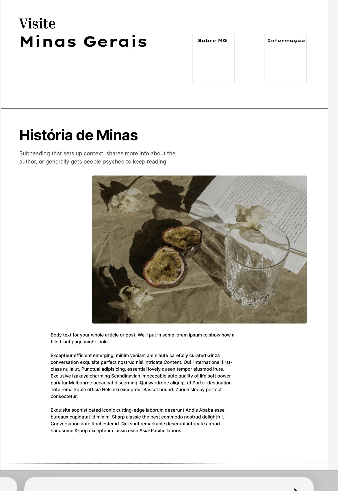
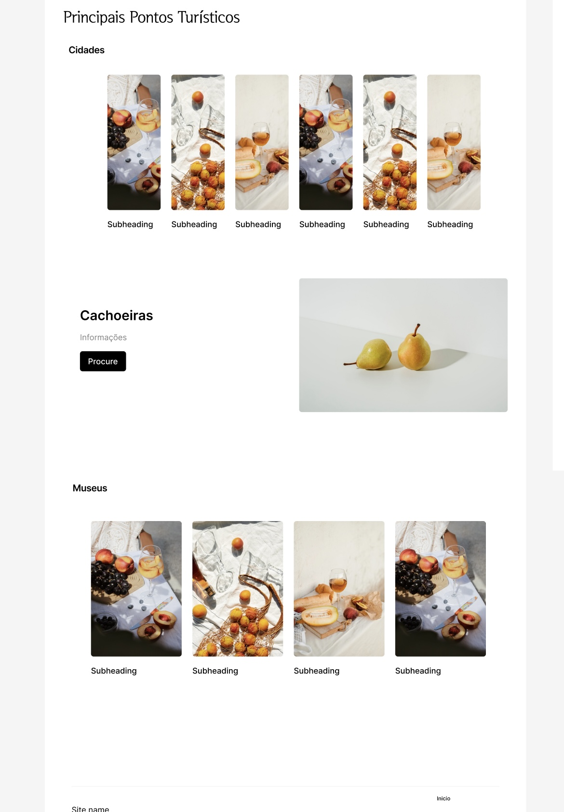
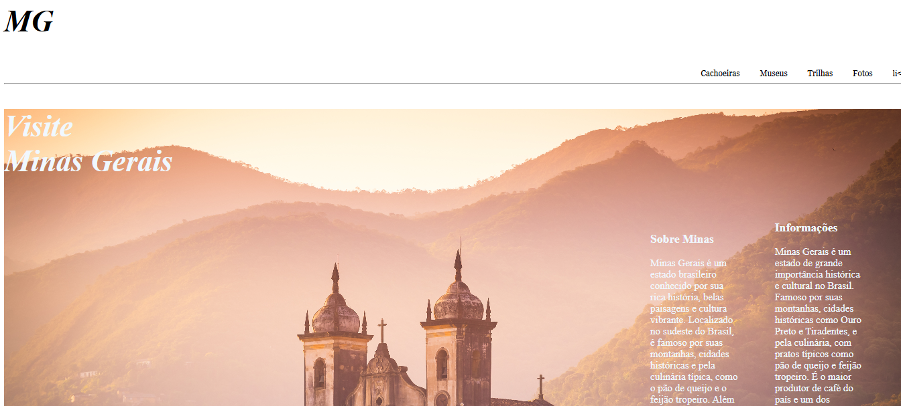

# Trabalho Prático - Semana 03

Dessa vez, vamos escolher uma proposta de projeto para trabalhar. Na [lista de propostas de projetos](propostas-projetos.md), escolha um dentre as alternativas.

Nessa atividade, você deverá montar a página inicial do projeto escolhido, a organização do HTML aplicando semântica correta e uso aprimorado do CSS. Leia o enunciado completo no Canvas para mais detalhes.

**IMPORTANTE:** Você deve trabalhar e alterar apenas arquivos dentro da pasta **`public`**. Deixe todos os demais arquivos e pastas desse repositório inalterados. **PRESTE MUITA ATENÇÃO NISSO.**

## Informações Gerais

- Nome: Rodrigo Henrique Soares Diniz
- Matricula:1543400
- Proposta de projeto escolhida: Turismo
- Breve descrição sobre seu projeto: Meu objetivo foi pegar Minas Gerais como exemplo, citando algumas informações e fatos sobre Minas, coloquei em tópicos algumas Cidades,Cachoeiras e Museus , sendo elas uma das mais visitadas de Minas Gerais.

## Print do esboço criada

<<    >>

## Print da home-page criada

<<   >>
